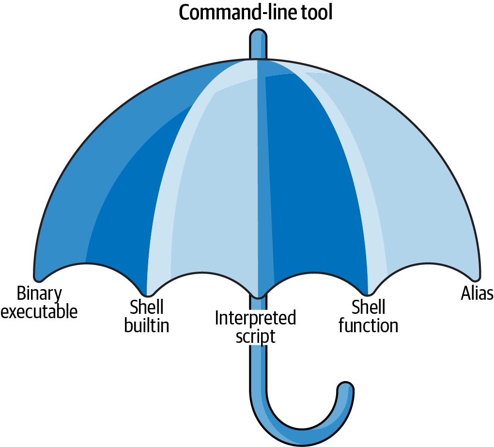

```{r setup, include=FALSE}
options(htmltools.dir.version = FALSE)
knitr::opts_chunk$set(
  fig.width=9, fig.height=3.5, fig.retina=3,
  out.width = "100%",
  cache = FALSE,
  echo = TRUE,
  message = FALSE, 
  warning = FALSE,
  hiline = TRUE
)
```

```{r xaringan-themer, include=FALSE, warning=FALSE}
library(xaringanthemer)
style_duo_accent(
  primary_color = "#1381B0",
  secondary_color = "#FF961C",
  inverse_header_color = "#FFFFFF",
  colors = c(
    red = "#f34213",
    purple = "#3e2f5b",
    orange = "#ff8811",
    green = "#136f63",
    white = "#FFFFFF")
  )

# style_mono_accent(
#   base_color = "#1c5253",
#   header_font_google = google_font("Josefin Sans"),
#   text_font_google   = google_font("Montserrat", "300", "300i"),
#   code_font_google   = google_font("Fira Mono")
# )

# style_xaringan()


# library(RefManageR)
# bib = ReadBib("bootcamp.bib")
# BibOptions(
#   check.entries = FALSE,
#   bib.style = "authoryear", 
#   cite.style = "authoryear", 
#   style = "markdown",
#   hyperlink = FALSE, 
#   dashed = FALSE)

```


class: title-slide
background-image: url("assets/gil.logo.png"), url("assets/wanggu.jpg")
background-position: 10% 90%, 100% 50%
background-size: 160px, 100% 100%

# .white[台灣大學語言學研究所]
### .white[平溪望古。領域標竿微型工作坊]


---
# 本工作坊目的

- 在伺服器上，或是在筆電上有效率的使用指令列，是語料計算的入門技能。

- 希望相關的技能，可以增強大家的語言分析裝備。


???
speaker's note


---
class: inverse center middle

# 開始囉


---
## 先從基本概念開始

> Why Language Science at the Command Line?


- 了解Unix (and Linux) 是嵌入裝置與雲端伺服器工作的必須 (Check Raspberry Pi/Amazon EC2)

- `linux` 是作業系統 (operating system, OS)  的一種。開源，可靠，運行在世界大部分的伺服器上。

- 指令列工具的意思其實很廣，我們簡化在用系統提供的基本指令。

<p align="right">

</p>


.footnote[image credit: [J.Janssens](https://datascienceatthecommandline.com/2e/chapter-2-getting-started.html#getting-the-data)]


???
ubuntu 的發音（南非）： how to pronounce Ubuntu?
Ubuntu (Zulu pronunciation: [ùɓúntʼù]) is a Nguni Bantu term meaning "humanity". It is sometimes translated as "I am because we are" (also "I am because you are"), or "humanity towards others" (in Zulu, umuntu ngumuntu ngabantu).


---
class: inverse center middle

#  可以簡單解決的，就不要用複雜的方式。


---
## 登入與登出，成功的一半
### Logging into a Unix-based remote server

- Getting your Username, Password, and Server Address

- using ssh, (short for ‘secure shell’) 

```{bash, eval=FALSE}
ssh 140.112.147.112
```

- `exit` will close an ssh connection


---
## 萬一不行的備案 (可跳過)
#### 安裝 Docker Image

- A Docker **image** is a bundle of one or more applications together with all their dependencies. 

- A Docker **container** is an isolated environment that runs an image.
(In a way, a Docker container is like a virtual machine, only a Docker container uses far fewer resources).

```bash
# 先下載與安裝 Docker，並執行
# 下載 image
$docker pull datasciencetoolbox/dsatcl2e
# 執行
$docker run --rm -it datasciencetoolbox/dsatcl2e
```

測試是否在 container 裡面

```bash
$cowsay "Let's moove\!"
```


---
## 首先看到的東西

- **the shell**: 翻譯妳的指令給系統核心的程式。通常是叫 **bash**，也有別的 (如 *zsh* 已經變成 MacOS 預設,等等)


- **the prompt ($)** 提示字元，妳下指令的地方。
  - 打個 `whoami` ，或是 `cal` 來看看


.footnote[可以用 `echo "$SHELL"` 知道目前使用哪種類型的 shell]


---
## 目錄和檔案處理 1


- 我們一開始會被放在專屬於自己的家目錄 (HOME directory)。而妳目前所在的資料夾稱作工作目錄 (working directory)。

- 整個檔案系統是由 .green[根 (root)] 開始，之後會向樹一樣不斷分支長出去

- 知道妳身處何處，開始第一個指令 `pwd` (顯示目前工作目錄)。注意到斜線 (slash) `/` 符號。
```bash
$pwd
/home/shukai
```

.footnote[目錄可以理解為檔案夾]

---
## 目錄和檔案處理 2


- 再來，要有 .green[路徑的概念]
  
  - **絕對路徑** 指的是從根開始出發的路徑，這種路徑不管你的工作目錄在哪裡都不會影響執行。`例如: /home/shukai/XD.txt`。  
  
  - **相對路徑** 指的是從工作目錄開始的路徑，如果你在不同的工作目錄使用會得到不同的效果。

--

- 用 `cd` (更換工作目錄到指定的目錄) 來練習

```bash
# .. 表示往上一層走
$cd ..

# 切換到當前目錄下的shukai 目錄中， . 表示當前目錄。也可以直接 cd shukai
$cd ./shukai

# 切換到上層目錄中的good目錄中，.. 表示上一層目錄
$cd ../good

# 回家目錄
$cd ~

```


???
pwd + cd
理解路徑


---
## 好用查詢工具

不會迷路之後，建議安裝 `tldr` 這個工具。

```python
pip install tldr
```

--

- 指令的執行引數 (flag)
  - 以 `ls`  (列出當前目錄下的內容)這個指令來說，用 .green[tldr ls] 去看系統提供的 flag.   
  
  - 指令的句法：.green[command [-flags] [arguments].]
  
```bash  
$ls -la
```
--

- 順便了解一下權限 (permissions) 與 `chmod`
  - .red[owner, group, other user]
  - .red[read(r), write(w), execute(x)]

---
## 目錄和檔案處理 3
### 建立、移動、複製與刪除

- `touch` 在裡面建立一個空白檔案。之後的 `vim` 課程再教大家編輯文件內容。
```bash
touch my.txt
```

- `mkdir` 建立目錄

```bash
# 在自己的家目錄下建立一個新檔案夾 tmp
$mkdir tmp
```

- `cp`  拷貝檔案及目錄 (`cp -vi` 較安全)

- `mv`  .red[移動]或.red[重新命名]檔案

- `rm` 刪除檔案或目錄 (`rm -r` 所有目錄與檔案 < 🤔三思而行！)


---
## 練習


> 在 /mnt/hdd/cmd/ 下有個 `opening.txt` 檔案
使用 `cp` 把它複製到妳的目錄下，然後改名為 `test.txt`。


---
# 粗看檔案


- `cat` 依標準輸出顯示檔案內容; 串接檔案

- `more`（看檔案內容，滿頁暫停按 space 鍵繼續，按 q 結束）

- `less`（同上，但允許游標鍵上下捲動對內容進行瀏覽）

```bash
# 試看看在 test.txt 上的差異
```

---
## 萬用字元 (The * Wildcard)

- 可以使用 * 來代表許多檔案。
  - 實驗上，我們常需要批次地建立名字類似的空白檔案或目錄，如 `file0.txt,file1.txt ... file9.txt`。

```bash
$touch file{0..9}.txt
```
  - 或是

```bash
mkdir wavdir && mv *.wav wavdir
```


---
## 萬用字元


- 刪除 (提醒：Unix has no ‘undo’)

```bash
$rm -rf file{0..9}.txt

# 要三思而行的使用！
rm -r *
```


---
## 其他使用訣竅

- Tab Autocomplete

- 用上下鍵來找指令史 (Command History)

- `Ctrl+c` kill the process and return to a prompt.


---
## 輸入輸出、重導與管線

- 指令列的哲學：每個工具應該 do one specific task。根據不同需要在結合起來成為更彈性與強大的工具。如何結合？除了寫 `bash` **scripts**， 或是利用 **pipes** ！

- 有幾個運算子 
  - `<`  ‘Use this file as input’ 當輸入源
  - `>`  ‘Redirect the output to a file’ 存到
  - `>>`  ‘Append the output to a file’  新增到

```bash
$ls -l /usr/bin > ls-output.txt

# 將輸出加在原有檔案後面
$ls -l /usr/bin >> ls-output.txt
```

---
## 管線

- `|` 輸送命令的標準輸出到其他標準輸入。(.green[你的 output 就是我的 input])

```bash
$ls -l /usr/bin | less
```

- `||` 表示第一道指令執行失敗後, 才會執行第二道

```bash
cat notafile.txt || echo “fail”
```

---
## 執行多重指令的運算子 (operator)

-  `&` ：在背景執行 (進階使用者可以考慮 `screen` 指令)

So, if you want to run a long task (e.g. find and list every file on the hard drive containing “twi_”), but didn’t want your terminal frozen while it runs, you would run

```bash
$find / -name "twi_" -ls > twifiles.txt &
```
where the final & just says ‘Run this, and let me know when it finishes’.


- `&&` : 即第一道指令執行成功後, 才會執行第二道指令。

```bash
$mkdir txtfiles && mv subfolder/*.txt txtfiles && rm -r subfolder
```
will create a new folder called ‘txtfiles’, move all the text files out of a subfolder into it, then remove that subfolder.

---
class: inverse center middle

# 方便文本處理的指令們


---
## 細看

- `head`

```bash
$head -n 3 test.txt
```
- tail

- `wc` （計算字數、行數、字元數）

```bash
$wc test.txt
$wc -l test.txt
```


---
## grep/egrep
#### `grep` + `regex` = `egrep`

> `grep [-acinv] [–color=auto] ‘查詢字串’ filename`

- `grep -n` will print the line numbers of the matching lines (along with the matching lines)

- grep: 可以利用**正則表示法** 來搜尋文本中的特定模式。有許多參數可設定。

```bash
$grep -i -A 1 -B 10  work mydata.csv | head -n 5

# 結合管線
$ls /bin | sort | uniq | grep zsh
```


---
## 文檔處理

- `sort` ‘sort the file by contents’

- `uniq` (移除重複，常和 sort 連用。參數 -d 可以看重複的內容清單)

```bash
$ls /bin /usr/bin | sort | uniq | less
```


---
## 文檔處理

- `cut` (用來抽取文本中指定的 columns/characters)
  * -c: Will specify the filtering of characters
  * -d: Will specify the delimiter for fields
  * -f: Will specify the field number

```bash
#used the –d: option to specify that the field or columns are separated by a colon (:)
$cut -d: -f 1,3 /etc/passwd
# celex 還是用 deeplex sample
$head tc_celex.txt 
$cut -f2 tc_celex.txt | head
```

- `paste` 合併檔案行列 Merge lines of files.。paste two files horizontally, such as file1, which will become the first column and file2 will become the second column

```bash
$paste file_1 file_2
```
???
‘Extract a delimited column’

---
## 文檔處理

- `sed` 可用來搜尋與取代 (find and replace)
  - `$sed 's/oldtext/newtext/g' inputfile.txt.`
  - sed is also perfectly happy to take regular expressions,

```bash
$sed -e 's/love/愛/g' test.txt > test.txt
```

- `tr` ‘translate characters’

```bash
#transform spaces into newlines (putting each word onto a line)

$tr ' ' '\n' < test.txt
```


---
class: inverse center middle

## 用 linux 指令做文本資料科學分析: 
### 抓取、清理、探索、建模 


---
## 來練習

【1】. 建立目錄 `~/home/YOURNAME/data`

【2】. 抓 Charles Dickens 的 Oliver Twist (`http://www.gutenberg.org/cache/epub/730/pg730.txt`) 丟到這個目錄，改檔案名字為 `dickens.txt`

【3】. 移除文本中的 header 及 footer，存成 `dickens-clean.txt`

--
```bash
curl -s http://www.gutenberg.org/cache/epub/730/pg730.txt -o dickens.txt
less -N dickens.txt
# 利用 G 和上下頁鍵
sed '1,150d' dickens.txt > dickens-noheader.txt
sed '18682,19052d' dickens-noheader.txt > dickens-clean.txt
```

.footnote[老牌參考資源： [鳥哥的 linux 私房菜](http://linux.vbird.org/linux_basic/0220filemanager.php#less)]


---
## 再多練習一下

【4】. 全部去標點去數字去空白，並改成小寫之後建立詞頻表

【5】. 這個詞頻表中有一個詞彙 `bumble` 吸引了我們的目光，請用 `grep` 指令列出在它 `dickens-clean.txt`所在的地方（順便加上行數，與給它點顏色）

--

```{bash,eval=FALSE}
tr -d [:punct:] < dickens-clean.txt | tr -d [:digit:] | 
tr [:upper:] [:lower:] | tr -d '\r'| tr ' ' '\n' | sort | uniq -c | 
sort -r -g > dickens-wordfreq.txt
grep -E -n --color=auto "(B|b)umble" dickens-clean.txt
```


---
# 現在換妳來

[Lewis Carroll, Alice's Adventures in Wonderland](http://www.gutenberg.org/cache/epub/28885/pg28885.txt)

## 抓檔

--

```{bash,eval=FALSE}
wget http://www.gutenberg.org/cache/epub/28885/pg28885.txt
## alternatively
curl -s http://www.gutenberg.org/cache/epub/28885/pg28885.txt -o alice.txt

file pg28885.txt
cp pg28885.txt alice.txt
head -n 20 alice.txt
less -N alice.txt
```

---
# 清理、處理與探索

- Trimming the header and footer

```{bash,eval=FALSE}
sed '1,216d' alice.txt > alice-noheader.txt
sed '3422,3830d' alice-noheader.txt > alice-trimmed.txt
```

--
- Counting and Finding 

```{bash,eval=FALSE}
wc alice-trimmed.txt
grep " CHAPTER" alice-trimmed.txt
grep -n "Rabbit" alice-trimmed.txt
grep -E -n "(W|w)hite" alice-trimmed.txt
```


---
# 清理、處理與探索

- Standardizing the text

```{bash,eval=FALSE}
tr -d [:punct:] < alice-trimmed.txt > alice-nopunct.txt
tr [:upper:] [:lower:] < alice-nopunct.txt > alice-lowercase.txt
tr -d '\r' < alice-lowercase.txt > alice-lowercaself.txt
```

--

- Counting word frequencies more seriously!

```{bash,eval=FALSE}
tr ' ' '\n' < alice-lowercaself.txt > alice-oneword.txt
sort alice-oneword.txt > alice-onewordsort.txt
uniq -c alice-onewordsort.txt > alice-wordfreq.txt
```

---
# 綜合

- Pipelining everything 

```{bash,eval=FALSE}
tr ' ' '\n' < alice-lowercaself.txt | sort | uniq -c > alice-wordfreq2.txt
tr '[:punct:]' ' ' < alice-nofooter.txt | tr '[:upper:]' '[:lower:]' | tr '[:blank:]' ' ' |
sort | uniq -c | sed 's/ \{1,\}/","/g' | sed 's/^",//g' | sed 's/$/"/g'
w3m -dump http://www.gnu.org/gnu/manifesto.html | wc
```


---
## Convert one-liners into parameterized shell scripts


---
## 中文文本到詞頻表的管線處理 pipeline
#### Turn existing Python and R code into reusable command-line tools 


- 建立一個 jieba.R，放到處理資料的目錄下

```{r, eval=FALSE}
# thanks to simon
library(jiebaR)
txt = scan('stdin', what = 'char')
words_vector = worker() <= txt
words_char = paste(words_vector, collapse = ' ')
cat(words_char)
```

- 測一下魯迅

```{bash,eval=FALSE}
curl -s http://www.gutenberg.org/files/27166/27166-0.txt -o luxun.txt
cat luxun.txt | Rscript jieba.R | tr ' ' '\n' | sort | uniq -c -g | sort -r > luxun-wordfreq.txt
```


---
## 你不 R 你要 Py 之練習


```bash

```


---
class: inverse center middle

# Shell scripting


```shell
#!/bin/bash
# Clear the screen
clear
```


---
## awk


---
class: inverse center middle

# Non-textual data


---
## 語音與視頻

- `youtube-dl` - download videos from youtube.com or other video platforms

- `ffmpeg` - Audio and Video conversion tool

- `imagemagick` - Image processing tool


---
class: center, middle

# Thanks!


